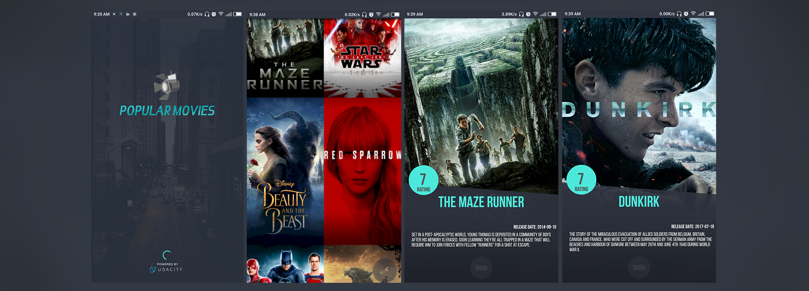

# PopularMovies
Second project for the Udacity Android Developer Nanodegree.
## Preview

## Platform
Android OS
## Features
* Present the user with the movie posters upon launch.
* Allow user to change sort order via a setting.
* Sort order can be by most popular or by highest-rated
* Allow the user to tap on a movie poster and transition to a details screen with additional information such as:

     (original title - movie poster image - overview - user rating - release date)

## Built With
* [Android Studio](https://developer.android.com/studio/index.html) - The Official IDE for Android
* [Photoshop](https://www.photoshop.com/) - Used for UI designing
* [The Movie DB](https://www.themoviedb.org/) - API for the Movies DataBase

## Used Libraries & SDKs
* [Android Support Libraries](https://developer.android.com/topic/libraries/support-library/packages.html)
* [DataBinding](https://developer.android.com/topic/libraries/data-binding/index.html)
* [Picasso](http://square.github.io/picasso/)
## Note
Dont forget to put your API KEY in strings.xml
